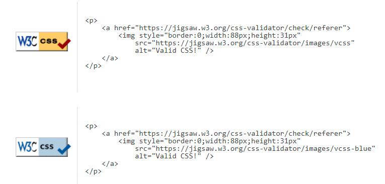

<br>

### The live link can be found here - [Game Central](https://salomonik.github.io/Code-Institute-Project-2/index.html)

# Game Central

## Description

**Game Central** is an engaging web-based gaming platform tailored specifically for younger audiences. It features a collection of familiar games such as Rock-Paper-Scissors, presented in a vibrant, cartoon-style aesthetic that appeals to children. Developed using HTML, CSS, and JavaScript, this platform is designed to provide a fun and safe environment for kids to enjoy interactive games.

## Site Owner Goals

The primary goal of Game Central is to captivate a young audience with user-friendly and entertaining games that can be played on any web browser. This project aims to foster a love for simple, classic games while providing a digital platform where children can spend time safely. Additionally, as a budding web developer, this project serves to sharpen my skills in web development and enrich my professional portfolio with a project that has real-world utility and appeal.

## Development Life Cycle

### Project Planning

The planning phase of Game Central was methodical. Here’s how it was structured:

1. **Goal Identification**: The first step involved clearly defining the objectives of the project. The main goal was identified as creating a fun and engaging platform for younger audiences with a selection of simple games. Secondary goals included using this project to enhance my web development skills and expand my portfolio.

2. **Target Audience Research**: Understanding the needs and preferences of the target audience—children—was crucial. This involved researching cognitive and physical capabilities of different age groups to ensure the games and UI/UX design were age-appropriate and engaging.

3. **Wireframing and Prototyping**: Sketches and wireframes were created using Balsamiq. This helped visualize the layout and transitions between different screens and interactions within the games.

4. **Technology Stack Decision**: Decisions on the tech stack were made early in the planning phase. HTML5, CSS3, and JavaScript were chosen for their versatility and support for complex interactive designs.

5. **Risk Assessment and Contingency Planning**: Potential risks like timeline delays, and technical challenges were identified.

### Research and Design

During the research phase, existing gaming websites/mobile-games were analyzed to determine popular functionalities and design trends. The design was crafted to be colorful and engaging, utilizing cartoon graphics and animations to capture the interest of young users.

### Content Requirements

The content for Game Central consists mainly of visual elements to support the games, including background images, game icons, and interactive buttons designed to be large and easy to interact with. Descriptive text is minimal, straightforward, and uses simple language suitable for children. Each game includes brief, easy-to-understand instructions.

### Development

- Environment Setup: Configured the development environment, including Git for version control and Visual Studio Code as the IDE.
- Implementation:
  - Phase 1: Developed the site structure using HTML5, ensuring semantic markup for accessibility.
  - Phase 2: Applied CSS for styling, with Bootstrap to aid responsive design. The platform was made responsive using CSS Flexbox and Grid, ensuring that it is accessible on a variety of devices, including tablets and smartphones typically used by children.
  - Phase 3: Developed javascript code for interactive elements.
  - Phase 3: Focused on content creation, populating the site with character descriptions, images, and media-related information.

## Requirements

### Functional Requirements

- **Game Functionality**: The game must allow users to select their move and provide immediate feedback on the outcome.
   - The application must allow users to play Rock-Paper-Scissors.
   - The game must provide immediate feedback on the outcome of each round.
   - The game must display animations corresponding to the result (win, lose, draw).
- **User Profiles**: The application must store the player's name and display it during gameplay.
- **Leaderboard**: The application must display the last 10 game outcomes in a leaderboard.
- **Feedback Mechanism**:
   - The application must include a contact form for users to submit feedback or ask questions.
   - The form must validate required fields (name, email) before submission.
- **Accessibility**:
   - ARIA labels must be used to improve screen reader compatibility.

### Non-Functional Requirements

- **Responsive Design**: The site must be fully responsive, adapting to different screen sizes and devices.
- **Performance**: The site must load quickly and efficiently on all supported devices and browsers.
- **Security**:
   - User data (names and scores) must be stored securely, with no personal information exposed.

- **Usability**:
   - The interface should be intuitive and easy to navigate, with minimal learning curve.

### Out of Scope
- **Multiplayer Functionality**:
   - The current project does not include real-time multiplayer capabilities.

- **Advanced Game Types**:
   - Only the Rock-Paper-Scissors game is implemented, other game types are planned for future updates.

## User Experience

User experience (UX) is central to the design and functionality of Game Central, ensuring that users of all ages find the platform engaging, intuitive, and fun. The UX is tailored to accommodate different types of users: first-time visitors, returning players, and frequent gamers.

### First-time User Experience:

For first-time users, the emphasis is on ease of navigation and immediate engagement. Upon visiting Game Central, users are greeted with a vibrant, cartoon-themed interface that is visually appealing to a younger audience. The main menu is straightforward, showcasing available games. First-time users can chceck instruction tutorial that explains how to play the games. This quick introduction ensures that users understand the gameplay mechanics without any confusion, making their first visit enjoyable and memorable.

### Returning User Experience:

- **Leaderboard Integration**: The leaderboard tracks the outcomes of the last 10 games played, displaying them in a historical list rather than a competitive ranking. This allows users to see their own recent performance and progression over time. The leaderboard serves as a personal record.

- **Player Name Storage**: By storing the player’s name in localStorage, the platform provides ease for more personal experience.

### Frequent User Experience:

Frequent users of Game Central are central to the iterative development process of the hub. Their ongoing engagement and feedback play a crucial role in both the refinement of existing features and the development of new content:

- **Feedback and Improvements**: Through the contact form, frequent users can directly communicate their suggestions and feedback. This direct line of communication is invaluable for gathering insights on user experience, game functionality, and potential new features. It ensures that the platform evolves in a way that meets the needs and expectations of its users. Every piece of feedback is considered, leading to regular updates and improvements that enhance the gameplay and user interface.

- **Game Development**: Currently, Game Central hosts a fully operational game of "Rock, Paper, Scissors" with additional games in the development phase. Frequent users can expect new gaming content as part of the platform's growth, driven by user feedback and developer innovation.

- **Anticipation and Engagement**: The announcement of upcoming games and features keeps frequent users involved and excited about what’s next. This anticipation builds a community around Game Central, where users are eager to see how their input has shaped the platform.

This proactive approach to user engagement ensures that frequent visitors not only see Game Central as a fun place to play games but also as a community that values their input and grows with their contributions.

## User Stories

- **As a user**, I want to be able to play a simple game like Rock-Paper-Scissors so that I can have fun during my free time.
- **As a user**, I want to see my recent performance in the game so that I can track my progress.
- **As a user**, I want to be able to contact the site owner for support or feedback so that I can have a better experience.
- **As a parent**, I want to ensure the games are safe and appropriate for my children so that I can feel comfortable letting them play.
- **As a developer**, I want to keep the code modular and maintainable so that it can be easily updated with new features.

## Design

### Typography and Fonts

- **Font Choices**: The project utilizes a combination of 'Fjalla One', 'Roboto' and 'Orbitron' fonts imported from Google Fonts. 'Fjalla One' is primarily used for headings due to its bold and clean appearance, which captures attention and makes headings stand out. 'Roboto', known for its readability, is used for body text to ensure content is easily digestible for younger audiences. 'Orbitron', with its techy and futuristic feel, is used in specific UI elements to add a modern touch, enhancing the thematic elements of the games.
- **Typography Rules**: Detailed typography rules are set in CSS for managing font sizes, line heights, and weights. This includes settings for different text elements like headings and paragraphs, ensuring content is not only readable but also aesthetically pleasing.

### Color Scheme

- **Color Variables**: The design incorporates a vibrant and playful color palette defined in CSS variables, which helps in maintaining consistency throughout the application. The primary color is a vivid red-orange, which adds a lively and energetic feel, suitable for a gaming environment. Secondary and accent colors are used to provide contrast and highlight important elements like buttons and interactive areas.
- **Usage of Colors**: The colors are thoughtfully applied across the UI to differentiate interactive elements, denote actions, and maintain visual interest. This approach helps in guiding users through their interactions with the game hub.

### Layout and Structure

- **Responsive Design**: The layout is built using Flexbox and CSS Grid, which provides a robust structure for arranging content and ensures the site is adaptable to different screen sizes. This is crucial for accessibility on devices predominantly used by children, such as tablets and smartphones.
- **Game-specific Layouts**: Each game screen has tailored styles to suit its content and functionality. For instance, game instruction screens and active game screens are styled distinctly to differentiate them clearly to the user.

### Interactive Elements

- **Button Styles**: Buttons are styled with dynamic effects such as color changes and size increases on hover, which not only improves user experience by making the interface interactive but also helps in drawing attention to actionable items.

## Color Reference

Colors are used purposefully throughout the design to enhance usability and aesthetic appeal, fitting the game's theme and making the interface lively and engaging.

| Color            | Hex                                                                |
| ---------------- | ------------------------------------------------------------------ |
| Background       |  `#F3F9F9` |
| Primary Color    |  `#fa541c` |
| Secondary Color  |  `#e5e9cc` |
| Accent Color     |  `#7CC8CA` |
| Navbar           |  `#fa541c` |
| Buttons          |  `#fa541c` |
| Text             |  `#000000` |
| Link Hover       |  `#ffffff` |
| Modal Background |  `#e5e9cc` |
| Footer           |  `#fa541c` |

This table provides a quick reference to the color palette used in the game hub, highlighting the consistency and thematic alignment across the user interface.

## Wireframe

<details>
<summary>Wireframe</summary>

<details>

<summary>Main Page</summary>


</details>

<details>
<summary>Start Game Page</summary>


</details>

<details>
<summary>Main Game</summary>


</details>

<details>

<summary>Form Page</summary>


</details>
<details>

<summary>About Page</summary>


</details>

</details>

## Features

The Game Central hub is designed to provide a fun and engaging experience for younger audiences with the following key features:

### Interactive Game Play

- **Rock-Paper-Scissors Game**: The classic game has been reimagined with colorful, cartoon-style graphics and animations that appeal to young players. Interactive elements with clear, responsive feedback make the gameplay intuitive.
- **Dynamic Score Tracking**: Scores are dynamically updated during gameplay, providing immediate feedback on wins, losses, and draws.
- **Game Animations**: Each action in the game triggers delightful animations, enhancing the interactive experience.

### User Profiles

- **Persistent Player Data**: Players can enter their name at the start of the session, which is remembered across the games using local storage.
- **Leaderboard**: Displays the last 10 game outcomes, allowing players to see their recent performance without competitive pressure.

### Accessibility

- **Responsive Design**: The game hub is fully responsive, ensuring that it can be accessed on a wide variety of devices, from desktops to tablets and mobile phones.

### Contact Form

- **Feedback Mechanism**: The contact form allows users to send feedback directly from the website, which is used to continuously improve the game experience.

### Future Expansions

- **More Games Coming Soon**: The current setup lays the groundwork for additional games to be added to the hub.

### Technical Features

- **HTML5 and CSS3**: Utilizes the latest HTML and CSS standards for modern, efficient design.
- **JavaScript Interactivity**: JavaScript is used to add interactivity to the games, handling game logic and user interactions seamlessly.

These features are designed to ensure that the game hub is not only fun and educational but also easy to use and accessible to as many users as possible.

## Screenshots

Here are several screenshots showcasing different aspects of the Game Central hub:

### Main Page

The main landing page where users are greeted and can navigate to different sections of the site.<br>


### Select Name Screen

A screen where users can enter and save their names for a personalized gaming experience.<br>


### Game Screen

The interactive game screen for Rock-Paper-Scissors, showing the game interface and options.<br>


### About Page

Provides information about the website and its purpose, enriching user understanding and engagement.<br>


### Contact Form

A contact form found on the `Contact` page, allowing users to provide feedback or ask questions.<br>


## Implementation Details

### Dynamic Image Sources

In the application, several `` tags initially have an empty `src` attribute that is dynamically filled via JavaScript based on user interactions or game progress. This approach is used to optimize loading times and manage resources efficiently, loading images only when necessary.

#### HTML Validation Note

During HTML validation, you might encounter errors like "Error: Bad value for attribute src on element img: Must be non-empty." This is expected due to our dynamic content loading strategy, where the `src` attributes of image elements are populated at runtime through JavaScript.

This method is intentional to enhance user experience by not loading all assets upfront, which can be particularly beneficial for users with slower internet connections or devices.

## Testing

- Conducted both manual and automated tests covering

### Automated Testing

- HTML

  - "Error: Bad value for attribute src on element img: Must be non-empty." - It is explained in HTML Validation Note.
    - [validator.w3.org results](https://validator.w3.org/nu/?doc=https%3A%2F%2Fsalomonik.github.io%2FCode-Institute-Project-2%2F)

- CSS

  - No errors were returned when passing through the official W3C Markup Validator by direct input.<br>
    - [jigsaw.w3.org results](https://jigsaw.w3.org/css-validator/validator?uri=https%3A%2F%2Fsalomonik.github.io%2FCode-Institute-Project-2%2F&profile=css3svg&usermedium=all&warning=1&vextwarning=&lang=en)<br>
      

- JS
  - No errors returned when passing via https://jshint.com/.<br> -<br> -

### Lighthouse Test

- \*

### Manual Testing

- The testing for Game Central included both automated and manual methods to ensure the application works as intended.

1. **Form Testing**:

   - The contact form was tested to ensure that all required fields are validated before submission.
   - The form require both Name and Email to be submited. It runs HTMLSelectElement.checkValidity() to confirm validation before submition.
   - Example: Attempting to submit the form without entering a name or email to check validation messages.

2. **Link Testing**:

   - All links were manually tested to ensure they navigate to the correct pages.
   - Example: Clicking each link on the homepage to verify it redirects to the intended page.

3. **Browser Testing**:

   - The application was tested on multiple browsers (Chrome, Firefox, Safari, Edge) to ensure compatibility.
   - Example: Opening the application on different browsers and verifying that all features work correctly.

4. **Responsive Design Testing**:
   - The responsiveness of the site was tested using Chrome DevTools and various devices (desktop, tablet, mobile).
   - Example: Checking the layout on different screen sizes to ensure it adapts correctly.

### Browser Test

- Tested on Windows/Android with different browsers, everything works as intended.
- Tested on Chrome, Firefox, Opera web browsers. I have tested user interactions, all work correctly. Responsiveness on all browsers tested and no anomally found.
- Tested on Android phone, responsiveness works corectly.
- Tested on Chrome developer tools to check responsiveness with different resolutions.
- Tested via
  - [http://www.responsinator.com/](http://www.responsinator.com/?url=https%3A%2F%2Fsalomonik.github.io%2FCode-Institute-Project-2%2Fcontact.html)
  - [https://ui.dev/amiresponsive](https://ui.dev/amiresponsive?url=https://salomonik.github.io/Code-Institute-Project-2/index.html)

## Bug Tracking and Fixes

**Scroll Bar Issue**: Scroll bars were appearing on mobile screens for `about.html` and `form.html`.

- **Fix**: Adjusted CSS to remove unnecessary scrolling on these pages.
- **Leaderboard Overflow**: The leaderboard was overflowing on small screens.
  - **Fix**: Limited the number of records displayed and adjusted CSS for better handling of overflow.

## Technologies Used

- HTML5
- CSS
- JS

## Frameworks - Libraries - Programs Used

- [DALL-E](https://openai.com/dall-e-3) - Used to create all graphics on site including background and character animations.
- [Balsamiq](https://balsamiq.com/) - Used to build wireframe.
- [Fontawesome](https://fontawesome.com/) - Used social icons for footer.
- [GoogleFonts](https://fonts.google.com/) - Used for typography on site.
- [Chrome Dev Tools](https://developer.chrome.com/docs/devtools/) - Used to check site responsiveness.
- [GitHub](https://github.com/) - Used as a version control and hosting.
- [W3C](https://www.w3.org/) - Used as a Validators to both HTML & CSS.
- [Remove BG](https://www.remove.bg/) - Used to remove background from images.

## Pre-Deployment Checklist

- Code Review: Ensured all code was clean, well-commented, and followed best practices.
- Final Testing: Conducted a final round of tests across all pages for responsiveness, broken links, and functionality issues.

## Deployment

- The project is deployed using GitHub Pages. Follow these steps to deploy it locally:

1. Clone the repository:
   ```bash
   git clone https://github.com/Salomonik/Code-Institute-Project-1.git
   ```

### Version Control

The project uses Git for version control, with the repository hosted on GitHub. The development process followed these steps:

1. **Initial Setup**: Created the initial repository and configured the development environment.
2. **Regular Commits**: Frequent commits were made to document progress and changes, ensuring a detailed history.

## Reflections

### Achievements

- **Enhanced Skills**: Working on this project allowed me to significantly enhance my web development skills, especially in the areas of responsive design, user interaction, and the integration of dynamic content using JavaScript.
- **AI Integration**: Successfully integrating DALL-E generated images was a milestone, showing my capability to blend emerging AI technologies with traditional web development to create a unique user experience.

### Challenges

- **Image Generation**: One of the main technical challenges was figuring out how to effectively use DALL-E to create images that fit seamlessly into the site’s design. Ensuring that these images maintained consistency with the site’s theme required careful planning and multiple iterations.
- **Game Development**: Implementing the interactive games, especially ensuring they are engaging and function seamlessly across different devices and browsers, proved to be challenging. It involved extensive testing and refinement.

### Lessons Learned

- **User-Centered Design**: This project reinforced the importance of user-centered design principles. I learned to prioritize accessibility and intuitive navigation to ensure a smooth user experience.

### Future Improvements

- **Adding More Games**: Plans are in place to expand the range of games available, which will cater to a wider audience and enhance user engagement.
- **Multiplayer Mode**: Adding a multiplayer mode to allow users to play against each other.
- **Enhanced Animations**: Improving game animations to make the experience more engaging.
- **Advanced Accessibility Features**: Implementing advanced accessibility features, such as screen reader support and high contrast

### Conclusion

Reflecting on this project, I appreciate the valuable insights gained and the growth in my technical capabilities. I look forward to applying these lessons to future projects.

## Acknowledgments

Antonio R. - my mentor for giving me tips how to do it properly. <br><br>
Slack / Reddit(webdev) community for support and knowledge.
